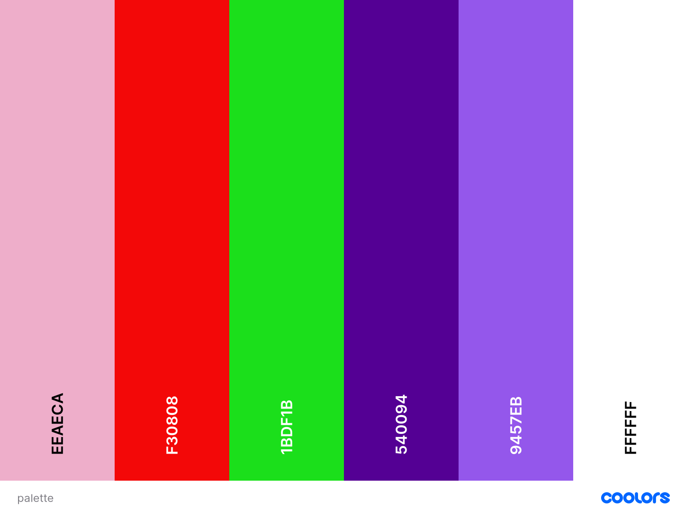
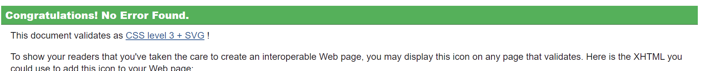

# [CineShow](https://github.com/JoseMachado-CE/CineShow)

This website has been created with the purpose of showing people a great variety of movies and cinemas around Dublin. It has been a great honor to be able to do this project and show my skills to whoever wants to see the project. Please, do not hesitate to leave a message in my github profile.

---
## Table of Contents
* [User Experience](#ux)
    * [User Goals](#user-goals)
    * [User Stories](#user-stories)
    * [Site Owners Goals](#site-owners-goals)
    * [User Requirements and Expectations](#user-requirements-and-expectations)
        * [Requirements](#requirements)
        * [Expectations](#expectations)
    * [Design Choices](#design-choices)
        * [Fonts](#fonts)
        * [Icons](#icons)
        * [Colors](#colors)
        * [Structure](#structure)
* [Wireframes](#wireframes)
* [Features](#features)
    * [Existing Features](#existing-features)
    * [Features to be implemented](#features-to-be-implemented)
* [Technologies used](#technologies-used)
    * [Languages](#languages)
    * [Libraries and Frameworks](#tools-and-libraries)
    * [Tools](#tools)
* [Testing](#testing)
* [Deployment](#deployment)
* [Credits](#credits)

  --- 
## User Experience
### User Goals
  * A website with good and up to date content.
  * A website that manages to display well all colors on the screen. 
  * A good and well formated contact form on the website.
  * Addresses of cinemas in Dublin.
### User Stories
  * A user wants to easily find the details about the movies.
  * A user wants to easily find the details about the cinemas in Dublin.
  * A user wants to quickly find what they are looking for.
  * A user wants to easily find the cinemas locations.
  * A user wants to find the cinemas locations displayed on a map.
  * A user wants to navigate smooth on the webiste displayed on tablets and cellphones.
  * A user wants to find different social medias associated to the website.
### Site Owners Goals
  * Advertise the CineShow.
  * In the middle of a pandemic where people find themselves lockded up in the houses, this website has the purpose of showing people good movies on IMDB and once everything is back open again, people can reach CineShow website in order to look for cinemas in Dublin.
  * Help people who is struggling locked in their own houses.
### User Requirements and Expectations
#### Requirements
  * Easy to navigate.
  * Appropriate Content about the service.
  * Good color contrast.
  * Right movies details.
  * Accurate location of cinemas in Dublin.
#### Expectations
  * Proper information about locations.
  * Relevant social medias.
  * Links that dont brake.
  * Quick return from website owner.
### Design Choices
#### Fonts
  * The fonts chosen on this website came from [Google fonts](https://fonts.google.com/). This choice has been made because of the probability of working on any browser.
#### Icons
  * Icons have been picked from [Font Awesome](https://fontawesome.com/).
#### Colors
  * Colors have been picked up from [Color Hunt](https://https://colorhunt.co/).
  * I also used the website [Coloors](https://coolors.co/) for make the colors pallet.

  
  * rgb(238, 174, 202), radial-gradient(circle, rgba(238, 174, 202, 1) 0%, rgba(148, 187, 233, 1) 100%) - Background color of entire website.
  * #242424 - Black used for the header and footer.
  * #540094 - Purple used for the buttons and some of the borders.
  * #9457eb - Purple used for the contact form and some of the borders.
  * #fff - White used for all the letters.
 

#### Structure
  * For the website structure I have been used [Bootstrap](https://getbootstrap.com/).

## Wireframes

I have decided to use [Balsamiq Wireframes](https://balsamig.com) to create 3 different wireframes for my website.

### [Desktop Wireframe](wireframes/desktop_WF1-MS1.pdf)
### [Iphone Wireframe](wireframes/iphone_WF1-MS1.pdf)
### [Tablet Wireframe](wireframes/tablet_WF1-MS1.pdf)

* The tablet wireframe has changed a little bit. The schedule panels will be displayed in vertical.
* The iphone wireframe and the desktop wireframe have changed only the contact button which got a bit smaller.
* The footer content has changed on all wireframes. Now it only says BlasT@Jose.

## Features
### 1. Existing Features
#### Navigation
The navigation bar that I used to work with for this website was navbar composed of an icon on the top left of the website along with the website name right on the next. Also on the navbar the website has 3 more options of items which they take you to 3 distincts pages.

#### ShowTime Movies
This link takes the person to the first page of the website where the person has the option of typing whichever movie they decide to look for. It also has a section on the bottom of the page which takes the person to the contact page.

#### Cinemas in Town
This link takes the person to the page where there are 6 options of cinemas from Dublin. There the person can link on any of the 6 buttons which will display the cinema details on the screen plus the location of its cinema on the map.

#### Contact
On this page the person has the option to fill out their details in order to receive news about movies from the website owner.

#### Contact Banner
This contact banner has been created in order to link the person to the contact form.

### Features to be implemented
* Links to external partners.
* Database to store all customers data.
* Chatbot to make user experience smoothier.

## Technologies used
### Languages
* [HTML5](https://en.wikipedia.org/wiki/HTML5) - used to create the HTML base.
* [CSS](https://en.wikipedia.org/wiki/CSS) - used to give style to the HTML5 elements.

### Libraries and Frameworks
* [Font Awesome](https://fontawesome.com/) - I used font Awesome for Icons.
* [Bootstrap](https://getbootstrap.com) - I used bootstrap for the navigation bar, carousel, pricing and footer
* [Google Fonts](https://fonts.google.com/)

### Tools
* [Gitpod](https://www.gitpod.io/) - I used gitpod for better tracebility.
* [Github](https://github.com/) - I used github for creating my repository
* [Git](https://git-scm.com/) - I used git as version control for better record of my coding.
* [Balsamic](https://balsamiq.com/wireframes/) - I Used it to create the Wireframes
* [Ami Mockup Image](http://ami.responsivedesign.is/) - I used it to create the mockup image with the website displayed in 4 different device frames.
* [Developer Mozilla](http://developer.mozilla.org) - I used this website to get the code for the carousel animation effect.
* [W3C HTML Validation Service](https://validator.w3.org/)
* [W3C CSS Validation Service](https://jigsaw.w3.org/css-validator/)
* [Axios](https://www.npmjs.com/package/axios)

## Testing
### Navigation bar

* **Plan**    
The plan for the navigation bar was to make it sticky on the top of the page. This same navbar would also collapse once the screen would get smaller such as tablets and phones screens.

* **Implementation**   
The entire navbar structure has been picked up from bootstrap. This choice has been made in order to make the project easygoing and easy once the screens turned into small screens.

* **Test**    
To test this I have opened the website in different browsers to see whether the navbar would brake. I also changed the size of the screen using inspect to also see whether the navbar would be off. 

* **Result**    
After all tests I could realize that the navbat would not brake. All different types of browsers and sizes of screens have been tested and the navbar would easy expand on large screen and it would easy collapse on small screens. 

* **Verdict**    
The test has passed all the criteria and works like planned.

### Modals
* **Plan**    
I wanted to implement 2 modals where the first of them would be the client fills out their details in a form and then to have a robot chat where it could answer the client straight away.

* **Implementation**    
The website has a contact form where the user can easily fill their information and even get emails back from the website owner. Although, I believe I do not have enough skills to come up with a robot to respond the users straigh away.

* **Test**    
I have tested the modal on various devices and browsers. 
The modal was very successfull taking the customer to where I wanted.

* **Result**    
The modal opened where and when it was supposed to happen.

* **Verdict**    
The modal works as planned and it met all the criteria. 

### Contact Form 
* **Plan**    
I wanted to have a contact form where the user could go and easily fill out their information in order to receive updates from the website owner.

* **Implementation**    
To be able to forward with this plan, I have picked the form code from [bootstrap](https://getbootstrap.com) and then with a little help of CSS3 the form would be created. I also plan to implement emailJS where the customer would really get an email back from the website owner. 

* **Test**    
The test used on the contact form was through filling the form many times with some spaces being left blank in order to see whether the website would acuse the user of a mandatory space that had to be filled out. Another test has been done through emailJS emailing myself to see whether this software would respond me back.

* **Result**    
It worked actually fine and really had the results that it was expected for.

* **Verdict**    
The form does meet all the criteria and works as planned. 

### Bugs

#### Form validation

* **Bug**    
The customer is able to submit the form without filling all necessary information on the form. This is not the expected experience for the customer.

* **Fix**        
JS skills were missing to do a better job here. The required piece of code inside the input tag could the job.

* **Verdict**    
Bug was resolved and form now works as planned. 

#### Hero Image

* **Bug**    
The hero image looked very good on big screens but it would not look that good when the screen reduced size.

* **Fix**    
After talking to my mentor we came up with a solution in order to fix this problem which was changing the background-attachment to scroll on mobile.

* **Verdict**    
Image now shows nicely on all devices and browsers.

#### Hamburger dropdown menu

* **Bug**    
On mobile devices the navigation bar would collapse but I noticed that it would not open after clicking on the button.

* **Verdict**   
After some researchs I could verify that my JS CDN code from boostrap was wrong so I fixed it and then the hambuguer button was working and openning normally.

#### Icons

* **Bug**    
The socia media icons was not being displayed properly on mobile screens. It would not bring a good experience to the user when surfing the website.

* **Fix**    
I made it look smaller on mobile screen and I added a space between each icon.

* **Verdict**    
Icons now show nicely next to each other on all devices and browsers. 

#### Navigation menu on smaller screensizes 

* **Bug**    
I noticed the same bug mentioned above with the button not working properly after clicking the button.

* **Fix**        
I fixed the CDN JS code which has provided by Bootstrap.

* **Verdict**    
Bug was solved making the user experience good.

## Deployment

This project has been deployed with GitHub by executing the following steps.
After writing the code I would save and then I would commit it and finally I would push it to GitHub.

1. Navigate to the repository on github and click **Settings**.
1. From there, go to the **Source section** within the Github Pages section.
1. Select **master branch** on the dropdown menu, and click save.
1. Now the website is live on **https://github.com/JoseMachado-CE/Blast**
1. Any time commits and pushes are sent to Github, the Github Pages site should update shortly after.

To run the project locally:

1. Click the **green Clone or Download button** on the Github Repository
1. Using the **Clone with HTTPS option**, copy the link displayed.
1. Open your IDE, and ensure the Git Terminal is open.
1. Change the working directory to the location where the cloned directory is to go.
1. Use the **"git clone" command** and paste the url copied in the second step.

## Credits

I used the [Flyefit](https://www.flyefit.ie/) website for inspirational ideas.
Some of the images of the website have been taken from [google images](https://google.com) and a few other images have been given to me through my girlfriend who does Crossfit.
One of the 2 iframe has been take from [google maps](https://www.google.com/maps/) and the other iframe was taken from [youtube](https://youtube.com).

I wanted to thank my mentor [https://github.com/eventyret](https://dehlin.dev/), for giving me all the support needed to finish the website.
I wanted to thank my girlfriend for letting me use my free time after work to get really involved in my project.
I wanted to thank also Code Institute and Slack for all support.
And God for make this all achieveable.
